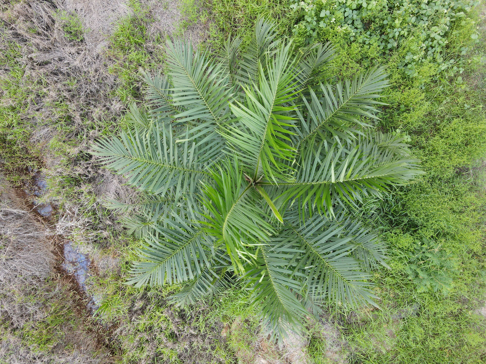
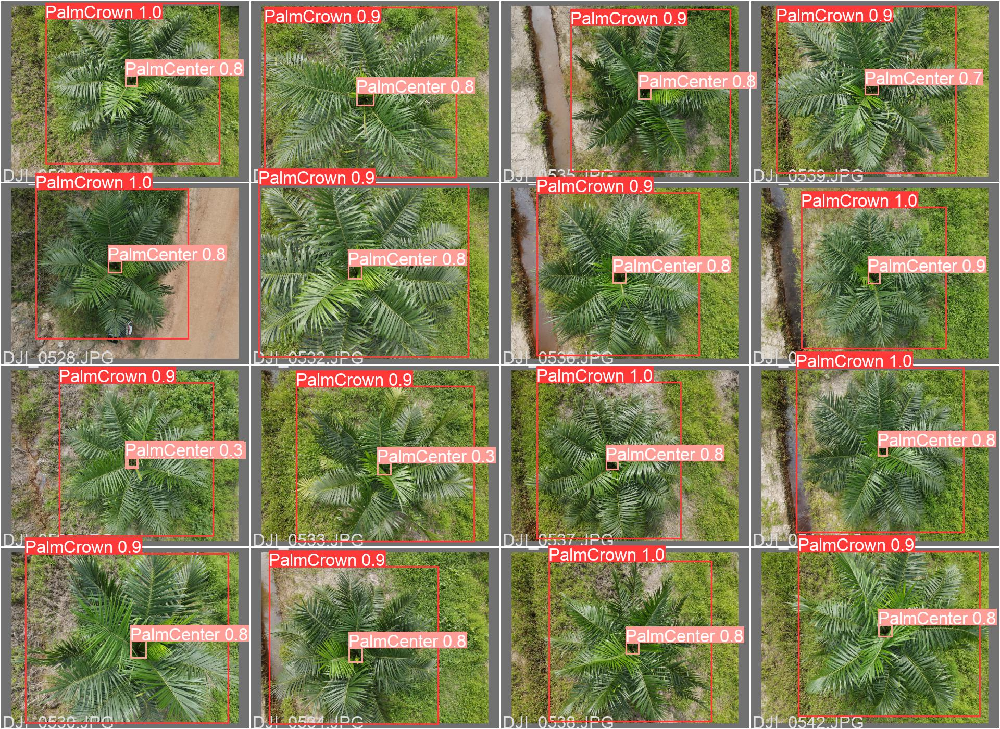
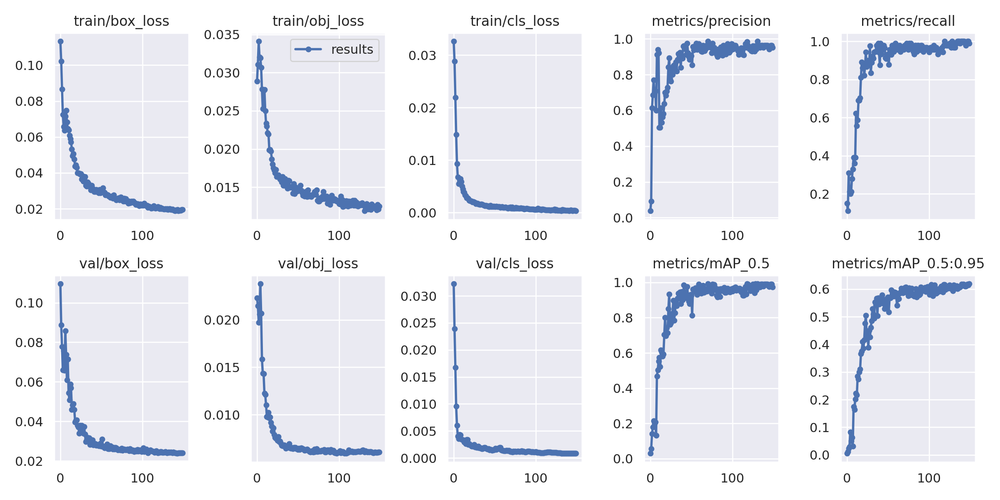
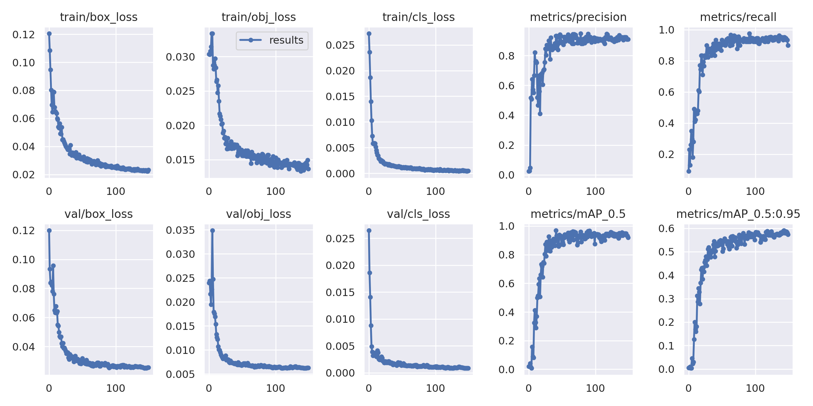
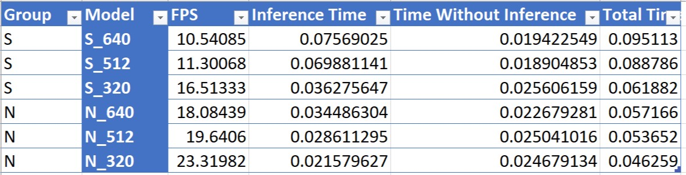
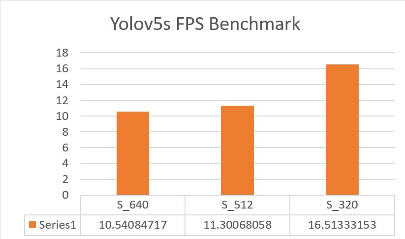
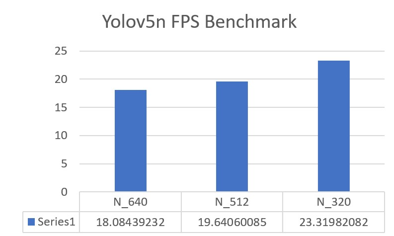

# Yolov5_Palm_Crown_Detection
This Repository contains project files for the YoloV5 image detection model to detect the top or 'crown' of oil palm trees.

The YoloV5 documentation can be found in the official [YoloV5 github repository](https://github.com/ultralytics/yolov5)

## Training

The code for training the palm crown detection model is contained in the `Palm Crown Detection - YoloV5 Training` jupyter notebook. 

Training can be done on any GPU-enabled computer or Google Colab (Recommended). 

#### Dataset
The dataset consists of 400 aerial palm crown images, taken using a DJI Mavic Air 2 Drone. 

Prior to training, the images were split into train, test and validation datasets. 

The data configurations are specified in the `palm_data.yaml` file 

I would like to credit and give thanks to my colleagues `Muhamad Hanif Hazemi` and `Muhammad Yusuf Musa` who flew the drone and did most of the data collection on the field. 

**Example Palm Crown Image from the Dataset**


#### Labelling and Annotations
YOLOv5 accepts annotations / labels in the following format:

```class x_center y_center width height```

- We can use [Roboflow](https://roboflow.com/) to label the images, or manually label the images using LabelImg. 
- Labels should be saved as a txt file, one file per image. 


#### Results

The trained models were successful in detecting palm crowns from image and video inputs. 

**Inference Results**


For object detection, mean average precision (mAP) is the primary metric that is used to measure model performance.

On the other hand, Intersection over Union (IOU) measures the amount of overlap between the detected object pixels and actual object pixels. We use IOU as a threshold to calculate precision. 

- mAP@0.5 refers to mean average precision at an IOU threshold above 0.5
- mAP@0.5:0.95 refers to the average mAP over different IOU thresholds between 0.5 to 0.95

For the trained models, the following metrics were obtained:
| Model        | mAP@0.5   | mAP@0.5:0.95 |
|--------------|-----------|--------------|
| YoloV5_Small | 0.97379   | 0.61941      |
| YoloV5_Nano  | 0.91846   | 0.57329      |

**Training Results for YoloV5_Small model**


**Training Results for YoloV5_Nano model**



## Deployment on Nvidia Jetson

After training, the models are saved in the project folder in Pytorch format (.pt)
We transfer and deploy the trained model into the Nvidia Jetson Platform for inference. 

#### Installing Pre-requisites
The following pre-requisites need to be installed on the inference hardware:
- Pytorch
- Torchvision

In addition, the YoloV5 github repository needs to be cloned to the inference hardware. 

More details about deployment and installation can be found [here](https://github.com/ultralytics/yolov5/issues/9627)

#### Running Inference
Finally, we can run real-time inference on our hardware by entering the following command:
```
sudo python3 detect.py --weights 'weights/best.pt'  --data 'palmlabel.yaml' --imgsz 640 640 --device 0 --source 0
```

**Input Parameters**
- weights: The path to our trained YoloV5 model
- data: The yaml file that points to our dataset directory and defines our custom class names
- imgsz: Size of the input images in pixels
- device: Setting device to 0 forces the hardware to use the GPU for inferencing
- source: Set the source to 0 to perform real-time inference from a usb camera or CSI camera. Alternatively we can set the source to an image path or video path for batch inference. 


## Communication
While performing real-time inference, we want to send the coordinates of our detected images to another python program or process. (For example, sending the coordinates to a servo motor controller for position adjustment). 

I have modified the original detection file by adding the ZeroMQ asychronous messaging library. The message transmission uses a Pub/Sub pattern, in which the detection file publishes the coordinates as soon as a detection occurs, and the receiver file subscribes to the incoming message stream and uses the data for further processing. 

`detect_mod1.py` is the modified file that contains the ZMQ code. 

## Performance Benchmarks

These benchmarks were measured using Nvidia Jetson Nano (2GB) hardware. For production purposes, it is recommended to use more powerful hardware such as Nvidia Jetson Xavier NX to achieve inference speeds of more than 30 FPS. 

In general, the inferencing speed of the models can be increased by:
- Using a smaller YoloV5 model with lesser weights (Small --> Nano)
- Using a smaller image size (640 --> 320)

During testing, it was found that the nano models with smaller image sizes generated a lot of false positives. Although the nano models produced better inference speeds in terms of FPS, the trade-off degradation in precision and recall was unacceptable. Only the small model paired with 640 image size (YoloV5S_640) produced acceptable results. 



**Benchmarks for YoloV5Small**


**Benchmarks for YoloV5Nano**


## References

1. https://github.com/ultralytics/yolov5
2. https://roboflow.com/
3. https://jonathan-hui.medium.com/map-mean-average-precision-for-object-detection-45c121a31173
4. https://datascience.stackexchange.com/questions/16797/what-does-the-notation-map-5-95-mean

